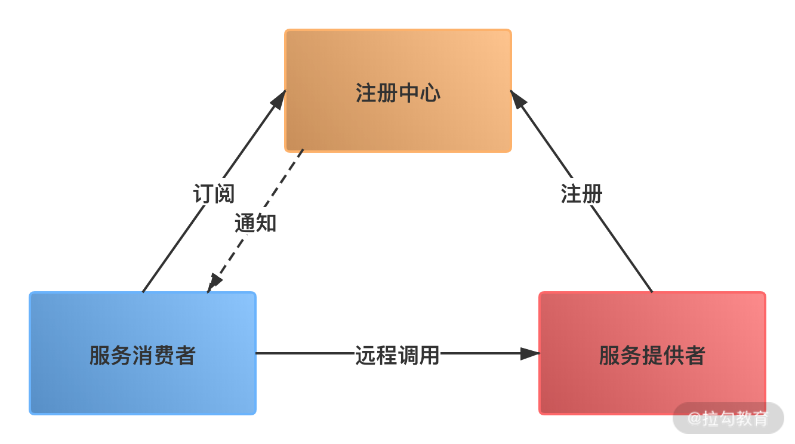

# 14 如何理解 RPC 远程服务调用？

本课时主要讲解 RPC 远程服务调用相关的知识。

RPC 远程服务调用是分布式服务架构的基础，无论微服务设计上层如何发展，讨论服务治理都绕不开远程服务调用，那么如何理解 RPC、有哪些常见的 RPC 框架、实现一款 RPC 框架需要哪些技术呢？

### 如何理解 RPC

RPC（Remote Procedure Call）是一种进程间通信方式，百科给出的定义是这样的：“RPC（远程过程调用协议），它是一种通过网络从远程计算机程序上请求服务，而不需要了解底层网络技术的协议”。

RPC 允许程序调用另一个地址空间的过程或函数，而**不用程序员显式编码这个远程调用的细节**。即无论是调用本地接口/服务的还是远程的接口/服务，本质上编写的调用代码基本相同。

比如两台服务器 A、B，一个应用部署在 A 服务器上，想要调用 B 服务器上应用提供的函数或者方法，由于不在一个内存空间，则不能直接调用，这时候就可以应用 RPC 框架的实现来解决。

### RPC 如何实现

早期的远程服务调用一般是通过 RMI 或 Hessian 等工具实现，以 Java RMI 为例，RMI 是 Java 语言中 RPC 的一种实现方式。

Java RMI（Java 远程方法调用，Java Remote Method Invocation）是 Java 编程语言里，一种用于实现远程过程调用的应用程序编程接口。应用 Java RMI，可以让某个 Java 虚拟机上的对象调用另一个 Java 虚拟机中的对象上的方法。

Java RMI 实现主要依赖 java.rmi 包下面的工具类，具体流程包括继承 Remote 实现远程接口，开发业务逻辑，创建 Server 并且注册远程对象，客户端创建 Client 调用远程方法等。关于 RMI 的实现细节，由于实际开发中很少应用，这里不展开讲解了。

以 Java RMI 为代表的的早期 RPC 实现起来比较繁琐，需要在代码中直接编码地址，并且不支持服务治理，比如无法对服务调用进行统计、无法梳理服务依赖情况、无法保证服务上下线时的稳定性等。随着分布式系统规模的增长，传统方式已经无法满足开发需求，于是诞生了一系列的 RPC 服务框架。

### RPC 框架代表

开源社区里有许多优秀的 RPC 框架，比如常用的 Dubbo、Thrift、gRPC 等，下面简单介绍一下这几款组件。

#### Apache Dubbo

Dubbo 是阿里巴巴公司开源的一个高性能 Java 分布式服务框架，目前已经成为 Apache 顶级项目。Dubbo 可以通过高性能的 RPC 实现服务的输出和输入，支持服务治理，提供了控制台界面，可以独立应用，也可以和 Spring 框架无缝集成。

Dubbo 在设计中采用了微内核架构，基于对 Java SPI 机制的扩展实现，Dubbo 对分布式服务调用核心功能都开放了扩展点，包括服务调用的负载均衡策略、序列化协议、传输协议等，使用者都可以添加自定义实现。

Dubbo 在国内曾经拥有很高的人气，是微服务架构的首选，后来随着 Spring Cloud 的流行，社区一度停更，外部用户发布了 DubboX 等升级版本。最近，Dubbo 社区又重新活跃，更新后的 Dubbo 也发布了 3.0 预览版等，并且宣布会在未来的版本中支持更多特性，值得期待。

#### Google 的 gRPC

gRPC 是 Google 开发的高性能、通用的开源 RPC 框架，gRPC 使用 ProtoBuf 来定义服务，ProtoBuf 是 Google 开发的一种数据序列化协议，性能比较高，压缩和传输效率高，语法也比较简单。另外，gRPC 支持多种语言，并能够基于语言自动生成客户端和服务端功能库。

#### Apache Thrift

Thrift 起源于 Facebook，和 Dubbo 一样，后来被提交 Apache 基金会将 Thrift 作为一个开源项目。Facebook 创造 Thrift 的目的是为了解决 Facebook 各系统间大数据量的传输通信，以及系统间语言环境不同需要跨平台的问题。

Thrift 支持多种编程语言，如 Java、C++、Python、PHP、Ruby 等，可以在多种不同的语言之间通信。应用 Thrift，需要在一个语言无关的 IDL 文件里，定义数据类型和服务接口，然后生成用来构建 RPC 客户和服务器所需的代码。

Thrift 主要的优点是跨语言；缺点是，由于需要定义独立的 IDL 文件，如果对服务进行修改，当数据结构发生变化时，必须重新编辑 IDL 文件、重新编译和生成相关的代码，修改起来比较繁琐。

#### 微博 Motan

Motan 是新浪微博开源的一个 Java RPC 框架，官方文档对外宣传在微博平台已经广泛应用，每天为数百个服务完成近千亿次的调用。

Motan 基于 Java 语言开发，设计和实现与 Dubbo 比较类似，包括服务提供者（RPC Server）、服务调用方（RPC Client）、服务注册中心（Registry）三个角色。服务端会向注册中心注册服务，消费端使用服务需要先向注册中心进行订阅，根据注册中心的返回列表与具体的 服务端建立连接，进行 RPC 通讯。当服务端发生变更的时候，注册中心也会同步变更，然后同步的通知到消费端。

Motan 也提供了服务治理的功能，包括服务的发现、服务的摘除、高可用及负载均衡。

### RPC 框架用到哪些技术

了解了常见的 RPC 框架后，我们来看一下实现一个 RPC 框架需要哪些技术。

#### 如何建立通信

实现分布式服务框架，首先要解决不同节点之间通讯的问题，需要在客户端和服务器之间建立 TCP 连接，远程过程调用的所有交换的数据都在这个连接里传输。

一般来说，建立通信可以使用成熟的网络通信框架，比如 Java 语言中的 Netty，这是一个优秀的网络通信框架。在 Dubbo、Motan 中都应用了 Netty。

#### 如何进行网络传输

建立通信之后，节点之间数据传输采用什么协议，也就是选择什么样的二进制数据格式组织；传输的数据如何序列化和反序列化，比如在 Dubbo 中，传输协议默认使用 Dubbo 协议，序列化支持选择 Hessian、Kryo、Protobuf 等不同方式。

#### 如何进行服务注册和发现

服务注册和发现，也就是服务寻址，以 Dubbo 为例，下图分布式服务典型的寻址和调用过程：

服务注册，需要服务提供者启动后主动把服务注册到注册中心，注册中心存储了该服务的 IP、端口、调用方式（协议、序列化方式）等信息。

服务发现，当服务消费者第一次调用服务时，会通过注册中心找到相应的服务提供方地址列表，并缓存到本地，以供后续使用。当消费者再次调用服务时，不会再去请求注册中心，而是直接通过负载均衡算法从 IP 列表中取一个服务提供者调用服务。

上面列举了一些分布式服务框架的实现要点，除了这些，还有很多技术细节，比如如何实现服务调用，RPC 框架如何和服务层交互，Java 中通过代理实现服务调用，那么代理对象如何解析请求参数、如何处理返回值等。

### 总结

这一课时分享了 RPC 远程服务调用的概念，介绍了常见的 RPC 框架实现，以及 RPC 框架需要关心哪些技术。通过本课时的学习，相信你对 RPC 相关技术有了一个初步认识，如果对其中某个框架感兴趣，你可以在课后找一些资料深入了解。