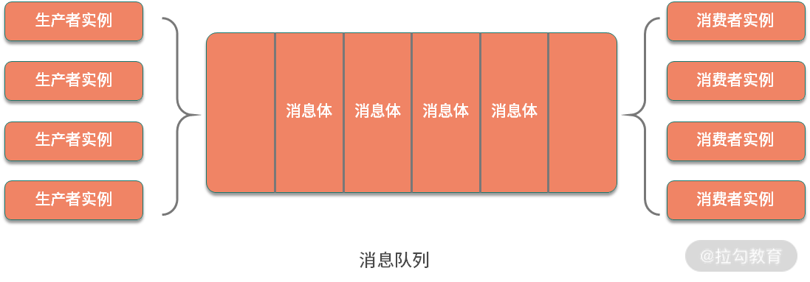
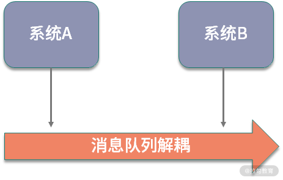

# 30 消息队列有哪些应用场景？

分布式系统不同模块之间的通信，除了**远程服务调用**以外，消息中间件是另外一个重要的手段，在各种互联网系统设计中，消息队列有着广泛的应用。从本课时开始，专栏进入分布式消息的模块，将讨论消息队列使用中的高频问题，先来看一下，消息队列的应用场景。

### 什么是消息队列

消息队列，顾名思义，就是传递消息的队列，学习操作系统中进程通信的时候我们知道，消息队列是进程之间的一种很重要的通信机制。随着分布式系统的发展，消息队列在系统设计中又有了更多的应用。

参与消息传递的双方称为生产者和消费者，生产者和消费者可以只有一个实例，也可以集群部署，典型架构如下图所示：

其中消息体是参与生产和消费两方传递的数据，消息格式既可以是简单的字符串，也可以是序列化后的复杂文档信息。队列是消息的载体，用于传输和保存消息，它和数据结构中的队列一样，可以支持先进先出、优先级队列等不同的特性。

### 消息队列有哪些应用

消息队列可以用于系统内部组件之间的通信，也可以用于系统跟其他服务之间的交互，消息队列的使用，增加了系统的可扩展性。下面把消息队列的应用归纳为以下几点。

#### 系统解耦

设计模式中有一个开闭原则，指的是软件实体应该对扩展开放、对修改关闭，尽量保持系统之间的独立，这里面蕴含的是解耦思想。而消息队列的使用，可以认为是在系统中隐含地加入了一个对外的扩展接口，能够方便地对业务进行解耦，调用方只需要发送消息而不用关注下游逻辑如何执行。

那你可能会有疑问，系统之间的解耦，使用 RPC 服务调用也可以实现，使用消息队列有什么好处吗？使用远程服务调用，需要在其中一个调用方进行显式地编码业务逻辑；如果使用消息队列就不会有这个问题了，系统之间可以更好地实现依赖倒转，这也是设计模式中的一个重要原则。

#### 异步处理

异步化是一个非常重要的机制，在处理高并发、高可用等系统设计时，如果不需要或者限制于系统承载能力，不能立即处理消息，此时就可以应用消息队列，将请求异步化。

异步处理的一个典型场景是**流量削峰**，我们用电商的秒杀场景来举例。秒杀抢购的流量峰值是很高的，很多时候服务并不能承载这么高的瞬间流量，于是可以引入消息队列，结合限流工具，对超过系统阈值的请求，在消息队列中暂存，等待流量高峰过去以后再进行处理。

#### 请求缓冲

在典型的生产者和消费者模型中，就是通过一个队列来实现缓冲的。使用消息队列，可以作为一个缓冲层，平滑各个业务系统之间处理性能的不同等，在早期的企业应用系统中，有一个企业数据总线（ESB）的概念，实现的就是内部各个系统之间的集成。

#### 数据分发

消息队列有不同的订阅模式，支持一对多的广播机制，可以用来实现数据的分发。典型的比如关系型数据库对 binlog 订阅的处理，由于主库的 binlog 只有一份，但是下游的消费方可能包括各种文件索引、离线数据库等，这时候就可以应用消息队列来实现数据的分发。

除了这些典型应用，消息队列还可以用来实现分布式事务，在第 06 课时“分布式事务有哪些解决方案”中我们提过，利用**数据库+本地消息表**的方式分布式一致性，是一个非常经典的分布式事务解决方案。

### 几种常见的消息队列

主流的消息中间件有以下几种，其中每种 MQ 又有其对应的应用场景。

#### Apache Kafka

大名鼎鼎的 Kafka 是高性能消息队列的代表，Kafka 是 LinkedIn 开源的一个分布式消息系统，主要使用 Scala 语言开发，已经加入 Apache 顶级项目。

Kafka 集群部署时依赖 ZooKeeper 环境，相比其他的消息队列，运维成本要高很多，ZooKeeper 的引入，使得 Kafka 可以非常方便地进行水平扩展，支持海量数据的传输。

Kafka 的另外一个特点是高吞吐率，在消息持久化写入磁盘的过程中，使用了多种技术来实现读写的高性能，包括磁盘的顺序读写、零拷贝技术等。

#### Apache RocketMQ

RocketMQ 是阿里巴巴开源的一款消息中间件，使用Java语言开发，在阿里内部应用非常广泛，很多高并发的业务场景下都有 RocketMQ 的应用。

RocketMQ 经过了双十一的检验，消息传递的稳定性和可靠性都比较有保障。以消息持久化为例，我们知道，Linux 文件在写入磁盘时，也就是常说的刷盘操作，因为存在缓存，可能会出现数据丢失的情况，RocketMQ 为了保证数据一致性，在写入磁盘时支持同步刷盘方式，即消息存储磁盘成功，才会返回消息发送成功的响应。

RocketMQ 在实现上有很多这种细节的设计，尽可能地保证了消息投递中的顺序一致性及可靠性，并且优化了响应时间，特别适合电商等相对复杂的业务中应用。

#### Apache RabbitMQ

RabbitMQ 是使用 Erlang 语言编写的一个开源消息队列，功能比较全面，支持多种消息传输的协议。

我们知道不同的消息队列有很多，为了约束其实现，也就有了一些对应的实现标准，AMQP 是一个异步消息传输的网络协议，RabbitMQ 是典型实现代表，除了 AMQP，RabbitMQ 同时支持 MQTT、STOMP 等协议，对于具体的协议内容，这里不展开，感兴趣的同学可以去找相关资料了解下。Kafka 和 RocketMQ 实现的是自定义协议，实现起来灵活度更高。

除了顺序传输，RabbitMQ 还可以支持优先级队列等特性，不过，它不适合处理大数据量的消息，一旦出现消息堆积，性能下降比较快，所以 RabbitMQ 比较适合企业级应用。

除了上面提到的三款主流消息队列，还有 ActiveMQ、ZeroMQ 等，也都有各自适合的应用场景。思考一下，如果在一个电商系统的构建中，这三款消息队列可以怎样组合使用呢？

Kafka 可以在各类数据埋点中使用，比如电商营销的转化率日志收集和计算，另外，Kafka 的高性能使得特别它适合应用在各类监控、大数据分析等场景。

RocketMQ 对一致性的良好保证，可以应用在电商各级业务调用的拆分中，比如在订单完成后通知用户，物流信息更新以后对订单状态的更新等。

RabbitMQ 则可以在数据迁移、系统内部的业务调用中应用，比如一些后台数据的同步、各种客服和 CRM 系统。

### 总结

这一课时分享了消息队列的知识点，包括消息队列的结构、消息队列的应用场景，以及几种常见的消息队列的应用。

通过本课时的学习，你已经了解了消息队列的基本应用，你可以结合自己的工作，思考一下都在哪些地方应用了消息队列，以及发挥了什么作用。继续扩展一下，如果让你来设计一个消息队列，应该怎么设计呢？比如消息体是否需要持久化？如何存储消息，如何保证消息的顺序投递，如果出现重复消费该如何解决，欢迎留言分享你的想法，关于这些问题的讨论，也会在后面的课时中展开讲解。