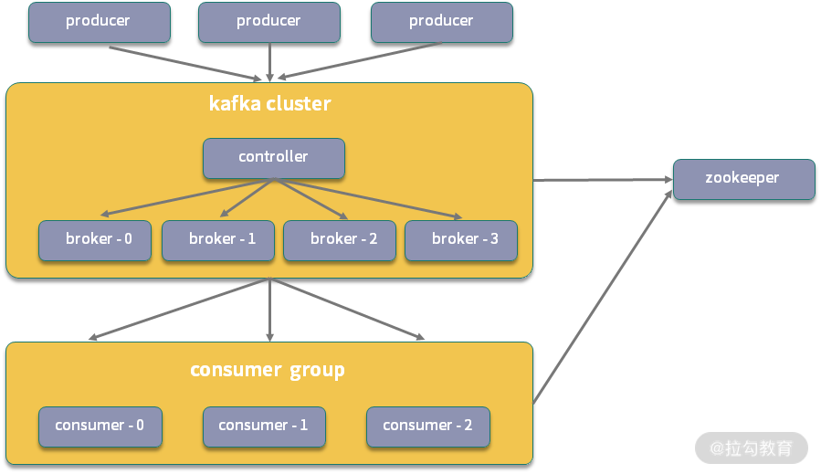
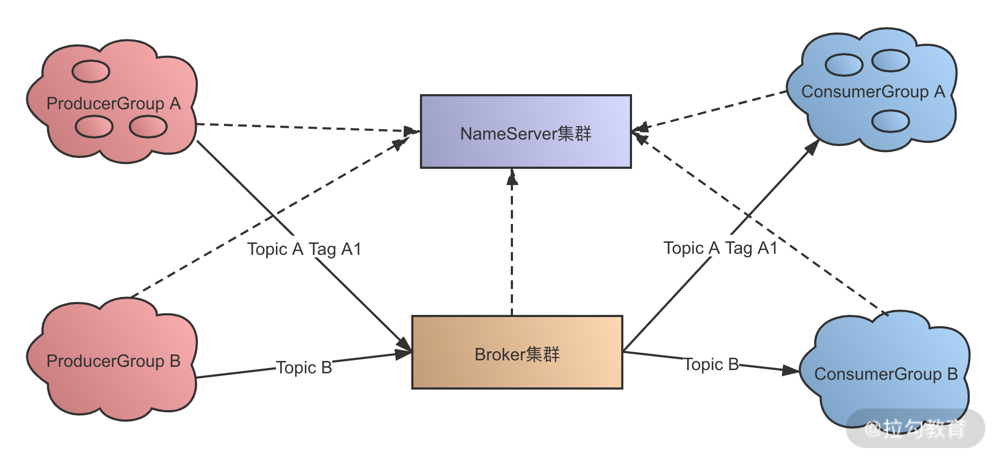
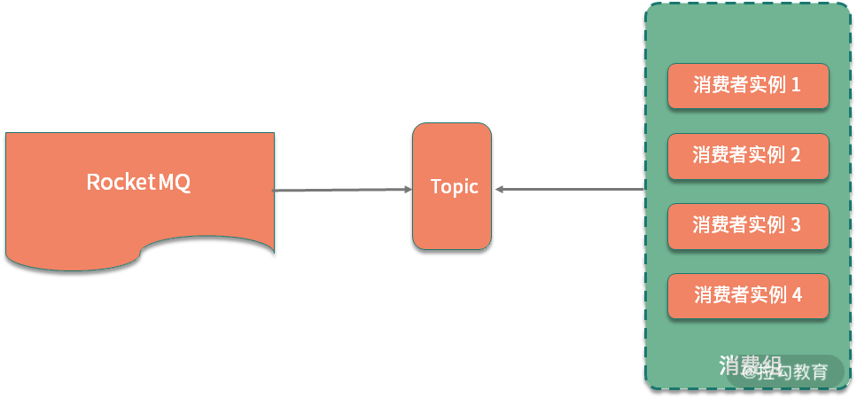

# 31 集群消费和广播消费有什么区别？

为了规范消息队列中生产者和消费者的行为，消息中间件的构建中会实现不同的消费模型。这一课时讨论的话题来自 RocketMQ 中具体的两种消费模式，是消息队列中两种典型消费模型的实现。接下来我们就一起来看一下消息队列都有哪些消费模型，以及对应的具体实现。

### 消息队列的消费模型

先来看一下消息队列的两种基础模型，也就是**点对点**和**发布订阅方式。**

这两种模型来源于消息队列的 JMS 实现标准，消息队列有不同的实现标准，比如 AMQP 和 JMS，其中 JMS（Java Message Service）是 Java 语言平台的一个消息队列规范，上一课时中讲过的 ActiveMQ 就是其典型实现。

AMQP 和 JMS 的区别是，AMQP 额外引入了 Exchange 的 Binding 的角色，生产者首先将消息发送给 Exchange，经过 Binding 分发给不同的队列。

和 JMS 一样，AMQP 也定义了几种不同的消息模型，包括 direct exchange、topic change、headers exchange、system exchange 等。其中 direct exchange 可以类比点对点，其他的模型可以类比发布订阅，这里不做展开介绍了，具体可参考 AMPQ 的其他资料查阅。

#### 点到点模型

在点对点模型下，生产者向一个特定的队列发布消息，消费者从该队列中读取消息，每条消息只会被一个消费者处理。

#### 发布/订阅模型

大部分人在浏览资讯网站时会订阅喜欢的频道，比如人文社科，或者娱乐新闻，消息队列的发布订阅也是这种机制。在发布订阅模型中，消费者通过一个 Topic 来订阅消息，生产者将消息发布到指定的队列中。如果存在多个消费者，那么一条消息就会被多个消费者都消费一次。

点对点模型和发布订阅模型，主要区别是消息能否被多次消费，发布订阅模型实现的是广播机制。如果只有一个消费者，则可以认为是点对点模型的一个特例。

现代消息队列基本都支持上面的两种消费模型，但由于消息队列自身的一些特性，以及不同的应用场景，具体实现上还有许多的区别。下面看一下几种代表性的消息队列。

### Kafka 的消费模式

先来看一下 Kafka，在分析 Kafka 消费模式之前，先来了解一下 Kafka 的应用设计。

Kafka 系统中的角色可以分为以下几种：

- Producer：消息生产者，负责发布消息到 broker。
- Consumer：消息消费者，从 broker 中读取消息。
- Broker：Broker 在 Kafka 中是消息处理的节点，可以对比服务器，一个节点就是一个 broker，Kafka 集群由一个或多个 broker 组成。
- Topic：Topic 的语义和发布订阅模型中的主题是一致的，Kafka 通过 Topic 对消息进行归类，每一条消息都需要指定一个 Topic。
- ConsumerGroup：消费组是对消费端的进一步拆分，每个消费者都属于一个特定的消费组，如果没有指定，则属于默认的消费组。

上面是一个 Kafka 集群的示意图，图中的 ZooKeeper 在 Kafka 中主要用于维护 Offset 偏移量，以及集群下的 Leader 选举，节点管理等。ZooKeeper 在 Kafka 中的作用，也是消息队列面试中的一个高频问题，感兴趣的同学可以去扩展一下。

从上面的分析中可以看到，Kafka 的消费是基于 Topic 的，属于发布订阅机制，它会持久化消息，消息消费完后不会立即删除，会保留历史消息，可以比较好地支持多消费者订阅。

### RocketMQ 的消费模式

RocketMQ 实现的也是典型的发布订阅模型，在细节上和 Kafka 又有一些区别。RocketMQ 的系统设计主要由 NameServer、Broker、Producer 及 Consumer 几部分构成。

NameServer 在 RocketMQ 集群中作为节点的路由中心，可以管理 Broker 集群，以及节点间的通信，在后面的消息队列高可用课时，我会进一步分析集群下的高可用实现。

具体的消费模式中，RocketMQ 和 Kafka 类似，除了 Producer 和 Consumer，主要分为 Message、Topic、Queue 及 ConsumerGroup 这几部分，同时，RocketMQ 额外支持 Tag 类型的划分。

- Topic：在 RocketMQ 中，Topic 表示消息的第一级归属，每条消息都要有一个 Topic，一个 Group 可以订阅多个主题的消息。对于电商业务，根据业务不同，可以分为商品创建消息、订单消息、物流消息等。
- Tag：RocetMQ 提供了二级消息分类，也就是 Tag，使用起来更加灵活。比如在电商业务中，一个订单消息可以分为订单完成消息、订单创建消息等，Tag 的添加，使得 RokcetMQ 中对消息的订阅更加方便。
- ConsumerGroup：一个消费组可以订阅多个 Topic，这个是对订阅模式的扩展。

在 RocketMQ 中，一个 Topic 下可以有多个 Queue，正是因为 Queue 的引入，使得 RocketMQ 的集群具有了水平扩展能力。

在上一课时中提过， Kafka 使用 Scala 实现、RabbitMQ 使用 Erlang 实现，而 RokcetMQ 是使用 Java 语言实现的。从编程语言的角度，RocketMQ 的源码学习起来比较方便，也推荐你看一下 RokcetMQ 的源码，[点击这里查看源码](https://github.com/apache/rocketmq)。

RocketMQ 的消费模式分为**集群消费**和**广播消费**两种，默认是集群消费。那么，在 RocketMQ 中这两种模式有什么区别呢?

集群消费实现了对点对点模型的扩展，任意一条消息只需要被集群内的任意一个消费者处理即可，同一个消费组下的各个消费端，会使用负载均衡的方式消费。对应 Topic 下的信息，集群消费模式的示意图如下。

广播消费实现的是发布订阅模式，发送到消费组中的消息，会被多个消费者分别处理一次。在集群消费中，为了将消息分发给消费组中的多个实例，需要实现消息的路由，也就是我们常说的负载均衡，在 RocketMQ 中，支持多种负载均衡的策略，主要包括以下几种：

- 平均分配策略，默认的策略
- 环形分配策略
- 手动配置分配策略
- 机房分配策略
- 一致性哈希分配策略

以上的几种策略，可以在 RocketMQ 的源码中 AllocateMessageQueueStrategy 接口相关的实现中：

### 总结

这一课时分析了消息队列中的两种消息模型，以及不同消息模型在 Kafka 和 RocketMQ 等消息队列中的具体实现。

消息模型的概念是分布式消息的基础知识，不同的消息模型会影响消息队列的设计，进而影响消息队列在消息一致性、时序性，以及传输可靠性上的实现方式。了解了这些，才能更好地展开关于消息队列各种特性的讨论。

在分布式系统中，为了保证高可用，引入了各种集群和副本技术，使得实际消息队列中的实现往往要比模型定义中复杂很多。上面提到的 Kafka 和 RocketMQ 实现的都是以发布订阅模式为主，但是在另外一个消息队列 RabbitMQ 中，实现的就是点对点的消息传输模式。RabbitMQ 是 AMQP 模型的典型实现，那么 RabbitMQ 是如何实现集群扩展的呢，以及集群模式有哪些区别？感兴趣的同学可以找相关的资料来了解一下，欢迎留言分享。