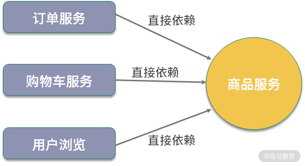

# 39 如何避免缓存穿透、缓存击穿、缓存雪崩？

设计缓存系统不得不考虑的问题是缓存穿透、缓存击穿与失效时的雪崩效应，同时，关于这几种问题场景的认识及解决方案，也是面试中的高频考点。今天的内容，可以说是缓存应用的三板斧，下面我们一起来分析一下缓存应用中的这几个热门问题。

### 缓存穿透

先来看一下缓存穿透，顾名思义，是指业务请求穿过了缓存层，落到持久化存储上。在大多数场景下，我们应用缓存是为了承载前端业务请求，缓存被击穿以后，如果请求量比较大，则会导致数据库出现风险。

以双十一为例，由于各类促销活动的叠加，整体网站的访问量、商品曝光量会是平时的千倍甚至万倍。巨大的流量暴涨，单靠数据库是不能承载的，如果缓存不能很好的工作，可能会影响数据库的稳定性，继而直接影响整体服务。

那么哪些场景下会发生**缓存穿透**呢？

- 不合理的缓存失效策略

缓存失效策略如果设置不合理，比如设置了大量缓存在同一时间点失效，那么将导致大量缓存数据在同一时刻发生缓存穿透，业务请求直接打到持久化存储层。

- 外部用户的恶意攻击

外部恶意用户利用不存在的 Key，来构造大批量不存在的数据请求我们的服务，由于缓存中并不存在这些数据，因此海量请求全部穿过缓存，落在数据库中，将导致数据库崩溃。

介绍了出现缓存穿透的原因，那么缓存穿透如何在业务中避免呢？首先是设置合理的缓存失效策略，避免缓存数据在同一时间失效。对于缓存失效策略的讨论，将在后面的第 36 课时中进行介绍，这里暂时不展开。

缓存穿透还可以通过缓存空数据的方式避免。缓存空数据非常好理解，就是针对数据库不存在的数据，在查询为空时，添加一个对应 null 的值到缓存中，这样在下次请求时，可以通过缓存的结果判断数据库中是否存在，避免反复的请求数据库。不过这种方式，需要考虑空数据的 Key 在新增后的处理，感兴趣的同学可以思考一下。

另外一个方案是使用布隆过滤器。布隆过滤器是应用非常广泛的一种数据结构，我们熟悉的 Bitmap，可以看作是一种特殊的布隆过滤器，布隆过滤器的实现细节不是本课时关注的重点，如果你对布隆过滤器还不熟悉，可以抽空查阅数据结构相关的资料学习。

使用布隆过滤器，可在缓存前添加一层过滤，布隆过滤器映射到缓存，在缓存中不存在的数据，会在布隆过滤器这一层拦截，从而保护缓存和数据库的安全。

### 缓存击穿

缓存击穿也是缓存应用常见的问题场景，其是一个非常形象的表达。具体表现：前端请求大量的访问某个热点 Key，而这个热点 Key 在某个时刻恰好失效，导致请求全部落到数据库上。

不知道你有没有听过二八定律（80/20 定律、帕累托法则），百度百科中对二八定律的具体描述是这样的：

> 在任何一组东西中，最重要的只占其中一小部分，约 20%，其余 80% 尽管是多数，却是次要的，因此又称二八定律。

二八定律在缓存应用中也不能避免，往往是 20% 的缓存数据，承担了 80% 或者更高的请求，剩下 80% 的缓存数据，仅仅承担了 20% 的访问流量。

由于二八定律的存在，缓存击穿虽然可能只是一小部分数据失效，但这部分数据如果恰好是热点数据，还是会对系统造成非常大的危险。

缓存击穿和缓存穿透都是降低了整体的缓存命中率，不过在表现上比较类似。缓存击穿可以认为是缓存穿透的一种特殊场景，所以在解决方案上也可以应用上面提到的那几种手段。

接下来看一下缓存雪崩，其是缓存穿透和缓存击穿升级的一种问题场景。

### 缓存雪崩

缓存雪崩的表现有两种，一种是大量的缓存数据在同一时刻失效，请求全部转发到数据库，将导致数据库压力过大，服务宕机；另外一种是缓存服务不稳定，比如负责缓存的 Redis 集群宕机。

在业务开发中，出现缓存雪崩非常危险，可能会直接导致大规模服务不可用，因为缓存失效时导致的雪崩，一方面是整体的数据存储链路，另一方面是服务调用链路，最终导致微服务整体的对外服务出现问题。

我们知道，微服务本身就存在雪崩效应，在电商场景中，如果商品服务不可用，最终可能会导致依赖的订单服务、购物车服务、用户浏览等级联出现故障。

你考虑一下，如果商品服务出现缓存雪崩，继而商品服务不可用，关联的周边服务都会受影响。

那么缓存雪崩在业务中如何避免呢？

首先是明确缓存集群的容量峰值，通过合理的限流和降级，防止大量请求直接拖垮缓存；其次是做好缓存集群的高可用，以 Redis 为例，可以通过部署 RedisCluster、Proxy 等不同的缓存集群，来实现缓存集群高可用。

### 缓存稳定性

今天介绍的内容，是大家在缓存应用时的一些总结，现在我希望你跳出这几个名词，从一个更高的维度来思考缓存应用的稳定性。

首先明确应用缓存的目的，大部分缓存都是内存数据库，并且可以支持非常高的 QPS，所以缓存应用，可以防止海量业务请求击垮数据库，保护正常的服务运行。

其次，在考虑缓存的稳定性时，要从两个方面展开，第一个是缓存的数据，第二个是缓存容器也就是缓存服务本身的稳定性。

从缓存数据的层面，有一个缓存命中率的概念，是指落到缓存上的请求占整体请求总量的占比。缓存命中率在电商大促等场景中是一个非常关键的指标，我们要尽可能地提高缓存数据的命中率，一般要求达到 90% 以上，如果是大促等场景，会要求 99% 以上的命中率。

从缓存服务的层面，缓存集群本身也是一个服务，也会有集群部署，服务可用率，服务的最大容量等。在应用缓存时，要对缓存服务进行压测，明确缓存的最大水位，如果当前系统容量超过缓存阈值，就要通过其他的高可用手段来进行调整，比如服务限流，请求降级，使用消息队列等不同的方式。

### 总结

这一课时的内容，分享了分布式缓存应用和面试的经典问题：缓存穿透、缓存击穿、缓存雪崩，以及对应这几种业务场景的解决方案。今天介绍的这几个问题场景，只是对缓存应用时一些高频问题的抽象，在实际业务开发中，永远都是具体情况具体分析，对不同的业务，适用不同的解决方案。

你在应用缓存时有哪些心得体会，比如如何提高缓存命中率，如何处理热点 Key 等，欢迎留言进行分享。

> 要避免缓存穿透、缓存击穿与缓存雪崩,可以采取以下措施:
>
> 1. 缓存穿透
>    发生原因:查询的key在缓存和数据库中都不存在,大量请求直接打到数据库。
>    解决方案:
>
> - 可以设置一个默认值,如果key不存在则返回默认值,避免请求直达数据库。
> - 对空值进行缓存,设置一个短过期时间,避免大量请求不能被缓存的情况。
> - 对某些key进行排队或限流,避免大量请求直接穿透缓存。
>
> 2. 缓存击穿
>    发生原因:缓存中存在的key在过期的一瞬间大量请求击穿到数据库。
>    解决方案:
>
> - 设置热点数据永不过期。
>   -对具有明显周期性热点数据的key值进行过期时间错移,让缓存不会在同一时刻全部过期。
> - 在高并发时开启锁,只让一部分线程去更新数据库和缓存。
>
> 3. 缓存雪崩
>    发生原因:大量的key设置了相同的过期时间,在过期时候大量线程去更新数据库和缓存,造成雪崩。
>    解决方案:
>
> - 对具有明显周期性热点数据的key值进行过期时间错移。
> - 加随机因子到缓存失效时间,避免大量key同时失效。
> - 对某些key单独设置过期时间,避免关键key被同时过期刷新。
> - 在高并发时开启锁,控制Key的刷新率,避免过高的刷新压力。
>   所以,通过设置默认值、缓存null值、使用排队限流、设置永不过期的热点数据、过期时间错移与随机过期因子、使用锁控制刷新率等方法,可以有效地避免缓存穿透、击穿与雪崩问题的发生,保证系统稳定性。
