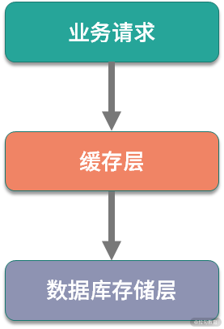

# 40 经典问题：先更新数据库，还是先更新缓存？

上一课时分享了缓存使用中的几个问题场景：缓存穿透、缓存击穿和缓存雪崩，这几个问题聚焦的是缓存本身的稳定性，包括缓存集群和缓存的数据，除了这些，缓存应用中，缓存和上下游系统的数据同步也很重要。这一课时，我们来学习缓存应用中的另一个高频问题：应用缓存以后，缓存和数据库何时同步。

### 数据不一致问题

我们知道，除了少部分配置信息类缓存，比如业务中的黑白名单信息、页面展示配置等，大部分缓存应用一般是作为前端请求和持久化存储的中间层，承担前端的海量请求。

**缓存层**和**数据库存储层**是独立的系统，我们在数据更新的时候，最理想的情况当然是缓存和数据库同时更新成功。但是由于缓存和数据库是分开的，无法做到原子性的同时进行数据修改，可能出现缓存更新失败，或者数据库更新失败的情况，这时候会出现数据不一致，影响前端业务。

以电商中的商品服务为例，针对 C 端用户的大部分请求都是通过缓存来承载的，假设某次更新操作将商品详情 A 的价格从 1000 元更新为 1200 元，数据库更新成功，但是缓存更新失败。这时候就会出现 C 端用户在查看商品详情时，看到的还是 1000 元，实际下单时可能是别的价格，最终会影响用户的购买决策，影响平台的购物体验。

可以看到，在使用缓存时，如果不能很好地控制缓存和数据库的一致性，可能会出现非常多的业务问题。

### 更新缓存有哪些方式

缓存更新方案是通过对更新缓存和更新数据库这两个操作的设计，来实现数据的最终一致性，避免出现业务问题。

先来看一下什么时候创建缓存，前端请求的读操作先从缓存中查询数据，如果没有命中数据，则查询数据库，从数据库查询成功后，返回结果，同时更新缓存，方便下次操作。

在数据不发生变更的情况下，这种方式没有问题，如果数据发生了更新操作，就必须要考虑如何操作缓存，保证一致性。

#### 先更新数据库，再更新缓存

先来看第一种方式，在写操作中，先更新数据库，更新成功后，再更新缓存。这种方式最容易想到，但是问题也很明显，数据库更新成功以后，由于缓存和数据库是分布式的，更新缓存可能会失败，就会出现上面例子中的问题，数据库是新的，但缓存中数据是旧的，出现不一致的情况。

#### 先删缓存，再更新数据库

这种方案是在数据更新时，首先删除缓存，再更新数据库，这样可以在一定程度上避免数据不一致的情况。

现在考虑一个并发场景，假如某次的更新操作，更新了商品详情 A 的价格，线程 A 进行更新时失效了缓存数据，线程 B 此时发起一次查询，发现缓存为空，于是查询数据库并更新缓存，然后线程 A 更新数据库为新的价格。

在这种并发操作下，缓存的数据仍然是旧的，出现业务不一致。

#### 先更新数据库，再删缓存

这个是经典的缓存 + 数据库读写的模式，有些资料称它为 Cache Aside 方案。具体操作是这样的：读的时候，先读缓存，缓存没有的话，那么就读数据库，然后取出数据后放入缓存，同时返回响应，更新的时候，先更新数据库，数据库更新成功之后再删除缓存。

为什么说这种方式经典呢？

在 Cache Aside 方案中，调整了数据库更新和缓存失效的顺序，先更新数据库，再失效缓存。

目前大部分业务场景中都应用了读写分离，如果先删除缓存，在读写并发时，可能出现数据不一致。考虑这种情况：

- 线程 A 删除缓存，然后更新数据库主库；
- 线程 B 读取缓存，没有读到，查询从库，并且设置缓存为从库数据；
- 主库和从库同步。

在这种情况下，缓存里的数据就是旧的，所以建议先更新数据库，再失效缓存。当然，在 Cache Aside 方案中，也存在删除缓存失败的可能，因为缓存删除操作比较轻量级，可以通过多次重试等来解决，你也可以考虑下有没有其他的方案来保证。

### 对缓存更新的思考

#### 为什么删除而不是更新缓存

现在思考一个问题，为什么是删除缓存，而不是更新缓存呢？删除一个数据，相比更新一个数据更加轻量级，出问题的概率更小。

在实际业务中，缓存的数据可能不是直接来自数据库表，也许来自多张底层数据表的聚合。比如上面提到的商品详情信息，在底层可能会关联商品表、价格表、库存表等，如果更新了一个价格字段，那么就要更新整个数据库，还要关联的去查询和汇总各个周边业务系统的数据，这个操作会非常耗时。

从另外一个角度，不是所有的缓存数据都是频繁访问的，更新后的缓存可能会长时间不被访问，所以说，从计算资源和整体性能的考虑，更新的时候删除缓存，等到下次查询命中再填充缓存，是一个更好的方案。

系统设计中有一个思想叫 Lazy Loading，适用于那些加载代价大的操作，删除缓存而不是更新缓存，就是懒加载思想的一个应用。

#### 多级缓存如何更新

再看一个实际应用中的问题，多级缓存如何更新？

多级缓存是系统中一个常用的设计，我们在第 32 课时“缓存分类”中提过，服务端缓存分为**应用内缓存**和**外部缓存**，比如在电商的商品信息展示中，可能会有多级缓存协同。

那么多级缓存之间如何同步数据呢？

常见的方案是通过消息队列通知的方式，也就是在数据库更新后，通过事务性消息队列加监听的方式，失效对应的缓存。

多级缓存比较难保证数据一致性，通常用在对数据一致性不敏感的业务中，比如新闻资讯类、电商的用户评论模块等。

上面的内容是几种常用的缓存和数据库的双写一致性方案，大家在开发中肯定应用过设计模式，这些缓存应用套路和设计模式一样，是前人在大量工程开发中的总结，是一个通用的解决范式。

在具体业务中，还是需要有针对性地进行设计，比如通过给数据添加版本号，或者通过时间戳 + 业务主键的方式，控制缓存的数据版本实现最终一致性。

另外还可以通过我们在第 32 课时“RocketMQ 应用”中讲过的 Binlog 分发方式，通过 Binlog 异步更新缓存。

### 总结

这一课时我们探讨了缓存和数据库一致性的问题，包括业务开发中如何通过控制更新缓存和数据库的时序，来尽量避免最终一致性问题。在专栏的第 1 课时就讨论过分布式系统的 CAP 理论，经过这么长时间的学习，你是否对 CAP 理论中的不可能三角有了更深的理解呢？

在你负责的项目中，是如何应用缓存，又如何保证缓存和数据库数据一致性的呢，欢迎留言进行分享。

